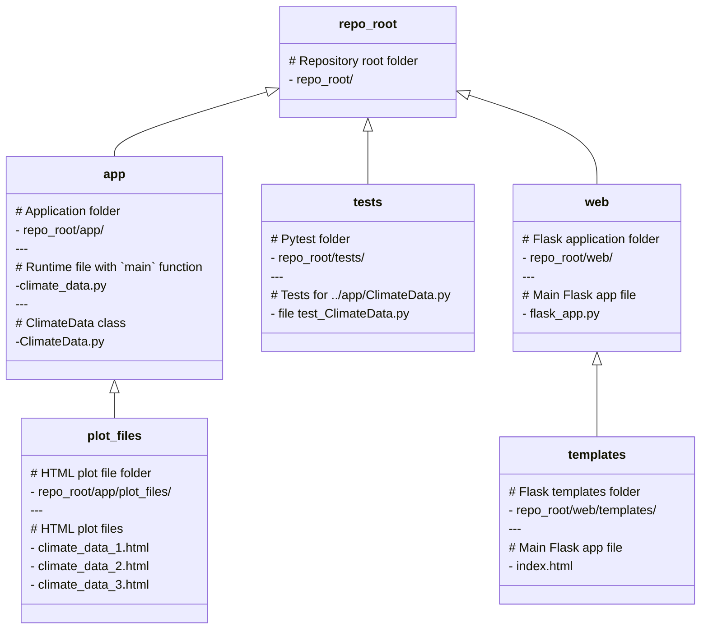

# climate-data-plotly Repository

Days 83 + 84 assignment for TalkPython #100DaysOfCode.

## Build & Quality Status

](https://img.shields.io/github/workflow/status/timothyhull/climate-data-plotly/Linting%20and%20Static%20Code%20Analysis?label=Linting%20and%20Static%20Code%20Analysis)

](https://img.shields.io/github/workflow/status/timothyhull/climate-data-plotly/pytest%20Testing?label=pytest)

## Application Framework

<!-- Application diagram -->

## Sources

Climate data sourced from the [IMF[^1] Climate Change Indicators Dashboard](https://climatedata.imf.org "IMF Climate Change Indicators Dashboard")

[^1]: International Monetary Fund
